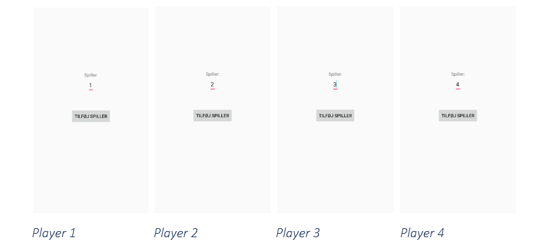

## What is MeteorQuest?
MeteorQuest is a prototype of a location-based mobile social game, where the players are guided to a real-world location to find and destroy a meteor. As the players are guided to the meteor, they are faced with three minigames that they must complete as illustrated in the following figure:


The game is developed as a four-player experience, and the purpose of open-sourcing it is to provide researchers and game developers with a platform that makes it easy to create a real-world game event. As it is right now, we have developed three minigames that can be part of the overall game experience, and we have made sure it’s easy for you to develop your own minigames and incorporate them in the game. In between the different mini-games, the players must work together to navigate. For that the players are divided into two roles: Communicators and navigators. The communicators are responsible for passing vital information in relation to the game to the other players. Several times during the game experience, the communicators will receive a call with information about the current stage of the game. This information ideally must be passed on to the other players. The navigators, on the other hand, are the only ones with access to the navigation methods called: Screen brightness and flashlight frequency. The screen brightness navigation method utilizes the brightness and color of the smartphone screen to tell the player, if they are getting closer or further away from the target, as seen in the next figure – green signals approaching the target, while red indicates moving away from the target. Flashlight frequency works similar to screen brightness, where the flashlight of the phone will turn on and off with different frequencies, depending on the players distance to the target - the closer they get, the faster it will blink.  


## Getting Started
MeteorQuest is a research platform developed for Android smartphones that allows researchers and developers to create game events in real-world locations. In order to create a game event, you just have to plot in the coordinates for the event (the meteor) in Google Firebase’s real-time database and install the application on your Android devices. The following sections will take you through the process of creating a game event and using MeteorQuest as a research platform.   

### Prerequisites
Before you can install and run the application you need to install and setup the following environments:

  * [Android Studio](https://developer.android.com/studio/) - The IDE used
  * [Google Firebase](https://firebase.google.com/) - The back-end system used

### Setup
Setting everything up and creating a game event can be divided into five steps. These steps will shortly be presented here and further explained in the next sections. 

```
1.	Clone repository and open in Android Studio
    a.	Install application on four devices
2.	Plot in coordinates in real-time database using the console in Google Firebase
3.	Start the game approximately 300 meters from the target
4.	When you start the application on the phones, the first screen will prompt you to type in the different player roles. Make sure to assign the roles 1-4 to the different players.
5.	Then you’re done with the setup and you can start the game. 

```

#### Step 1 - Clone repository and install on devices
Once you have installed Android Studio you can clone the repository, open it in Android Studio and install the application on four smartphones. 

#### Step 2 - Plot in coordinates for meteor in Google Firebase
Once the application in installed on the desired devices, you’re ready to plot in the coordinates for the meteor in Google Firebase. This is done by going to the following website: https://firebase.google.com/ and logging in with the right credentials. Once you’re logged in, you need to open the console, click on the project and locate the database on the left side menu and click on “Realtime Database” as illustrated in the following images:


Once you have done that, you will see a JSON-formatted database with a note called “coordinates”. Click on it to expand it, and here you’re able to plot in the latitude and longitude coordinates of where you want the meteor to be, as illustrated in the following image: 


#### Step 3 - Start the game 300 meters from target
The navigation methods work so that the game must start approximately 300 meters from the target. This can of course be changed in the source code, but our experience says that 300 meters is a good distance for the game. 

#### Step 4 - Type in different player roles from 1-4
Before you can start the game, the game will prompt you to type in the player role of each player, and the application will use this information to divide the players into the two roles of navigators and communicators. Player 1 and 3 will be delegated the role of communicators and player 2 and 4 will be delegated the role of navigators. The following images illustrate the screen that prompts you to type in the different player roles on each phone. 



#### Step 5 - Control and monitor game with Firebase console
Because MeteorQuest has been developed as a research platform, it requires you to control and monitor the different stages of the game. This is done from the before mentioned JSON-formatted real-time database, where you are able to start and stop the different minigames and provide clues to the players as sound files being played for them. Following is a short description of the different parts of the JSON-database and what parts of the game they control. All you have to do is to change some simple Boolean values from false to true, but remember to write it like this: “true” and not like this: true.  

##### “coordinates”
This is where you plot in the coordinates for the meteor, as described earlier.
##### “navigation”
While the players navigate, you’re able to play different sound files that helps the players. 
##### “player 1-4”
This stores the location of each player, so you can track their whereabouts during the game.
##### “skipintroduction”
From here you can choose to skip the introduction and go directly to one of the minigames or to navigation mode. 
##### “soundpuzzle”
This is used to control the minigame called “sound puzzle”, where you can stop the game and play a sound file that helps the players.
##### “startgames”
From here you can start each minigame, while the players are in navigation mode. 
##### “treasurehunt”
Here you can control the minigame called “treasure hunt”, where you can stop the game and play different sound files that helps the players. 

An image of the full JSON-formatted database is shown in the following image:


## Authors

* **Rasmus Rosenqvist** - *Head developer/Jedi* 
* **Jannik Boldsen** - *Junior developer/padawan* 
